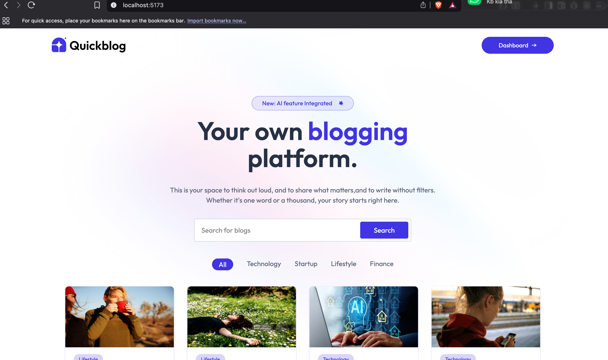
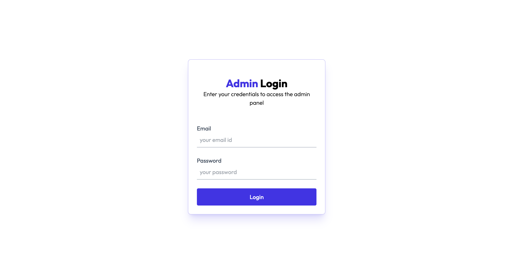
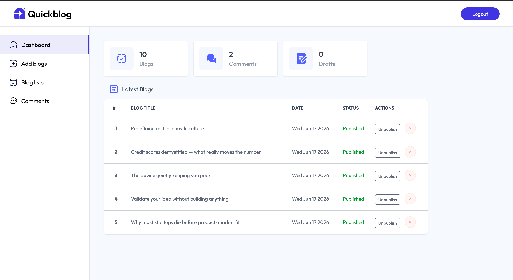
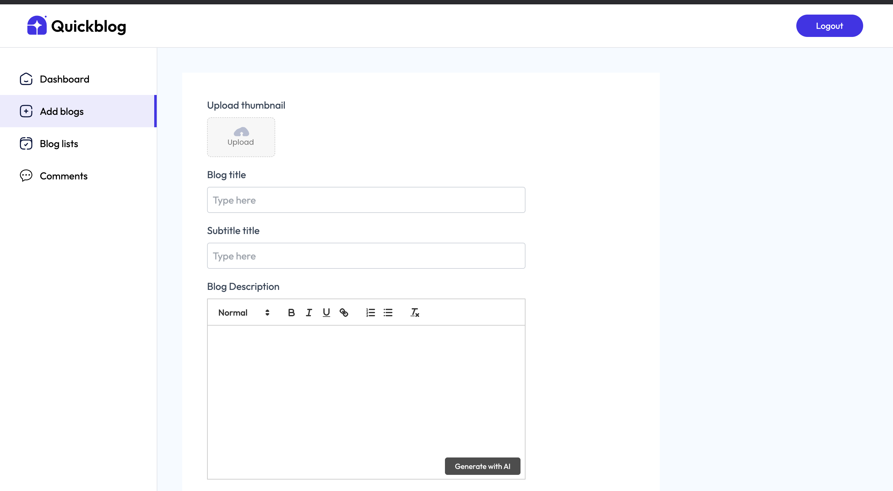
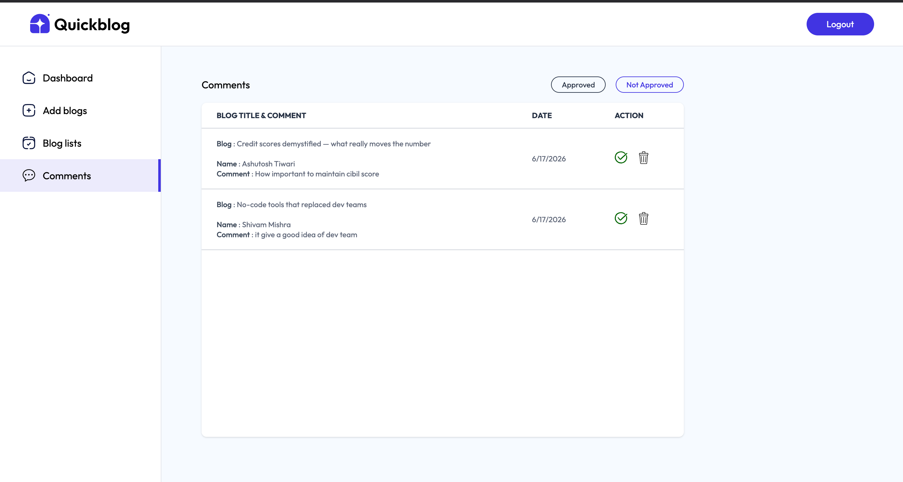
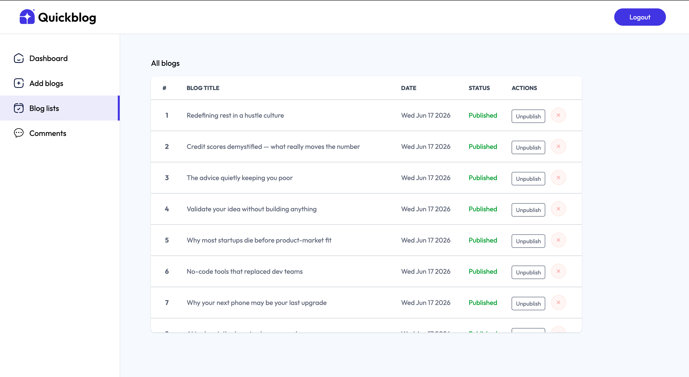

# 🚀 QuickBlog - AI Powered Blogging Platform

A modern full-stack blogging platform powered by AI, built using the MERN stack. QuickBlog combines content management, AI-assisted writing, image optimization, and blog moderation into a single application.

## 🌟 Overview

QuickBlog is a full-stack blogging platform featuring a public reader portal and a secure admin Content Management System (CMS). Administrators can create, edit, publish, and manage blogs using a rich-text editor, upload optimized images through ImageKit CDN, and generate blog content with Google's Gemini AI.

Readers can browse, search, and filter articles while interacting through a moderated comment system that ensures content quality through an approval workflow.

---
## 📸 Screenshots

The following screenshots showcase the key features and administrative workflows of the QuickBlog platform.


### Home Page


### Admin Login


### Admin Dashboard


### Add Blog Page


### Comment Moderation


### Blog Management



## ✨ Features

### 👨‍💼 Admin Panel

* Secure JWT-based admin authentication
* Create, edit, publish, and unpublish blogs
* Rich-text blog editor
* AI-powered content generation using Gemini API
* Blog management dashboard
* Comment moderation and approval system
* Image upload and optimization with ImageKit

### 👥 User Features

* Browse published blogs
* Search articles by keywords
* Filter blogs by category
* Responsive user interface
* Comment on blog posts
* Fast image loading through CDN delivery

---

## 🛠️ Tech Stack

### Frontend

* React.js
* Vite
* Tailwind CSS
* Axios

### Backend

* Node.js
* Express.js
* JWT Authentication

### Database

* MongoDB

### Third-Party Services

* Google Gemini API
* ImageKit CDN

### Deployment

* Vercel (Frontend)
* MongoDB Atlas

---

## 🏗️ System Architecture

```text
User
 │
 ▼
React + Vite Frontend
 │
 ▼
Express.js REST APIs
 │
 ├── MongoDB Atlas
 ├── Gemini API
 └── ImageKit CDN
```

---

## 📂 Project Structure

```text
QuickBlog
│
├── Client
│   ├── src
│   ├── public
│   ├── package.json
│   └── vite.config.js
│
├── server
│   ├── controllers
│   ├── middleware
│   ├── models
│   ├── routes
│   ├── server.js
│   └── package.json
│
└── README.md
```

---

## 🚀 Key Functionalities

### AI Blog Generation

Generate blog content automatically using Google Gemini AI, helping administrators create high-quality articles efficiently.

### Image Management

Images are uploaded and optimized through ImageKit CDN, improving loading speed and user experience.

### Comment Moderation

All user comments go through an approval workflow before becoming publicly visible.

### Secure Administration

JWT-based authentication ensures that only authorized administrators can manage content.

---

## 🔧 Installation

### Clone Repository

```bash
git clone https://github.com/your-username/AI---Powered-Blogging-platform.git
```

### Frontend Setup

```bash
cd Client
npm install
npm run dev
```

### Backend Setup

```bash
cd server
npm install
npm start
```

---

## 🔐 Environment Variables

Create a `.env` file and configure the following variables:

```env
MONGODB_URI=
JWT_SECRET=
GEMINI_API_KEY=
IMAGEKIT_PUBLIC_KEY=
IMAGEKIT_PRIVATE_KEY=
IMAGEKIT_URL_ENDPOINT=
```

**Important:** Never commit `.env` files to GitHub.

---


## 🎯 Learning Outcomes

Through this project, I gained hands-on experience with:

* Full-Stack MERN Development
* REST API Design and Integration
* JWT Authentication & Authorization
* MongoDB Database Design
* AI Integration using Gemini API
* CDN-based Image Optimization
* State Management in React
* Deployment and Version Control using Git & GitHub

---

## 🔮 Future Enhancements

* User Authentication & Profiles
* Rich Text Formatting Enhancements
* Blog Analytics Dashboard
* Like and Bookmark System
* Social Media Sharing
* Email Notifications
* Role-Based Access Control

---

## 👨‍💻 Author

**Shivam Mishra**

MCA Graduate | Full-Stack Developer

### Skills

### Skills

MERN Stack • JavaScript • React.js • Node.js • Express.js • MongoDB • Tailwind CSS • Git • REST APIs • JWT Authentication • Gemini API • ImageKit

---

## ⭐ Support

If you found this project useful, consider giving it a ⭐ on GitHub.
